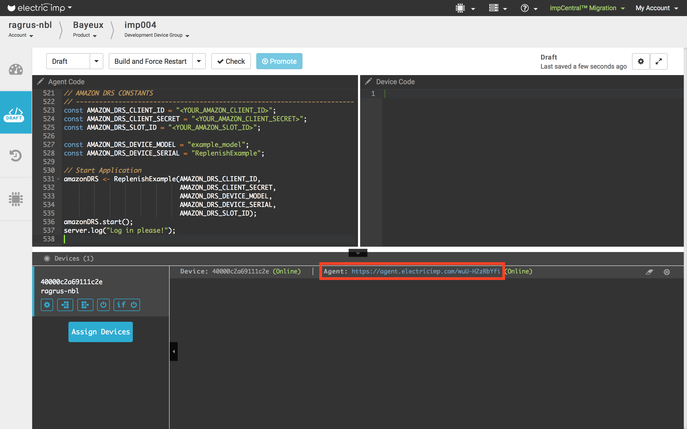
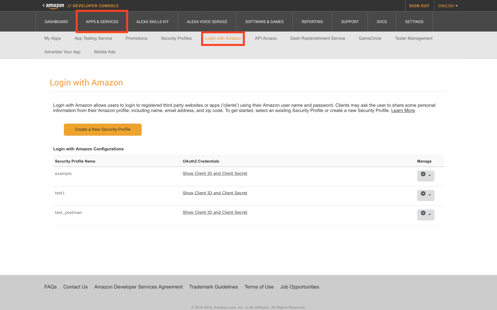
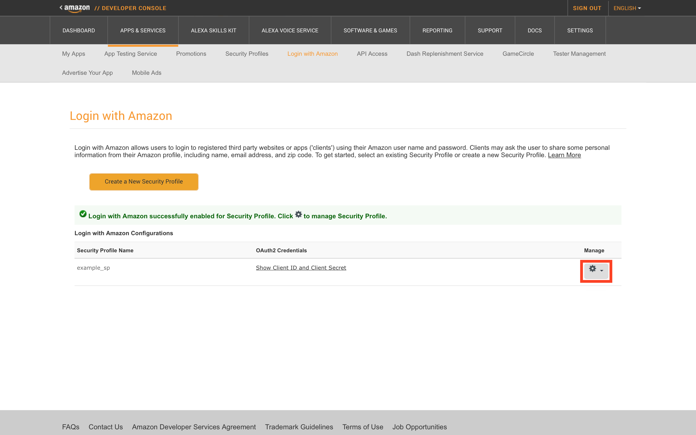
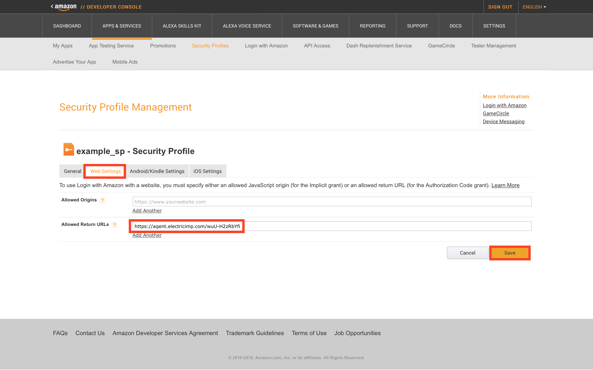
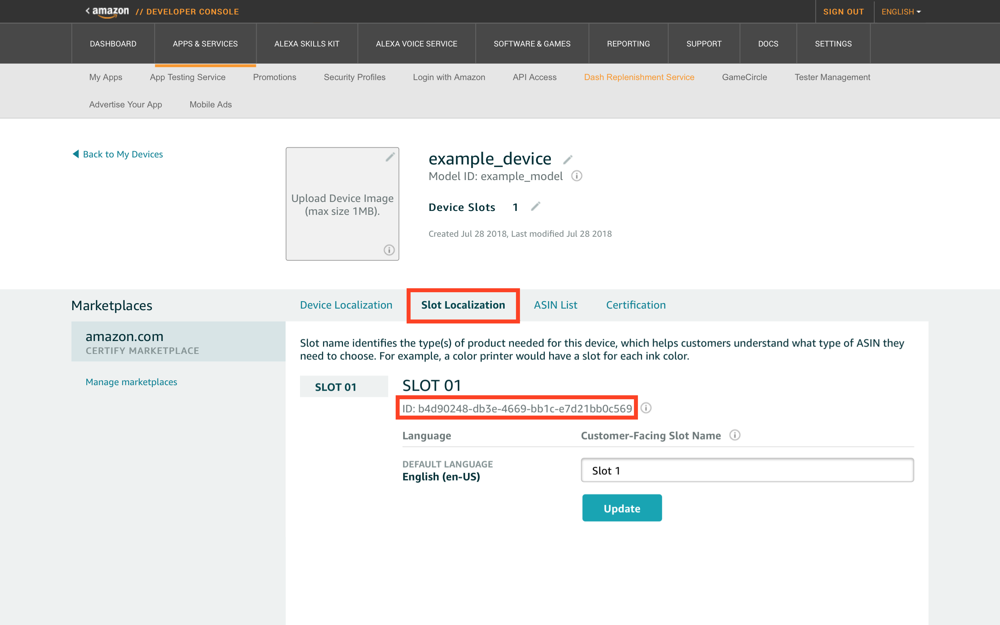
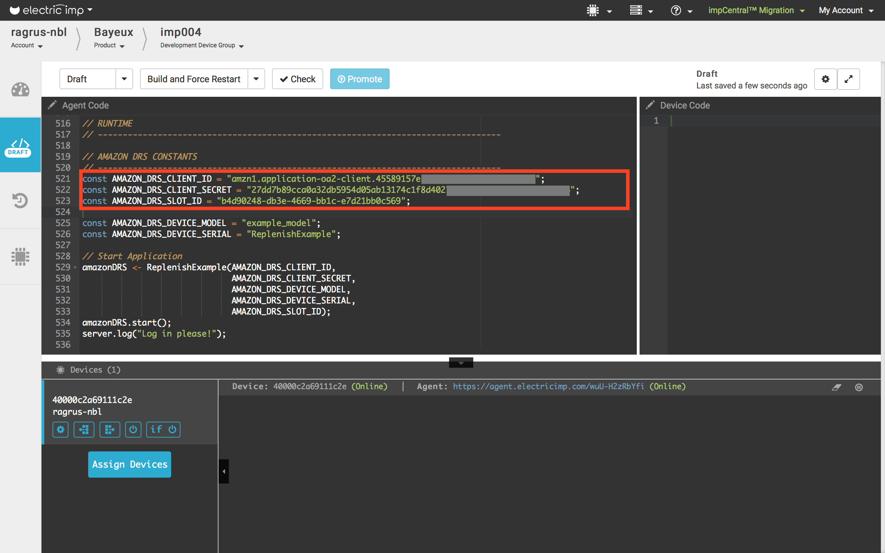
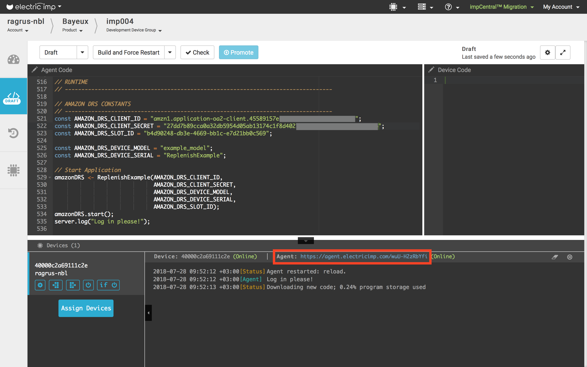
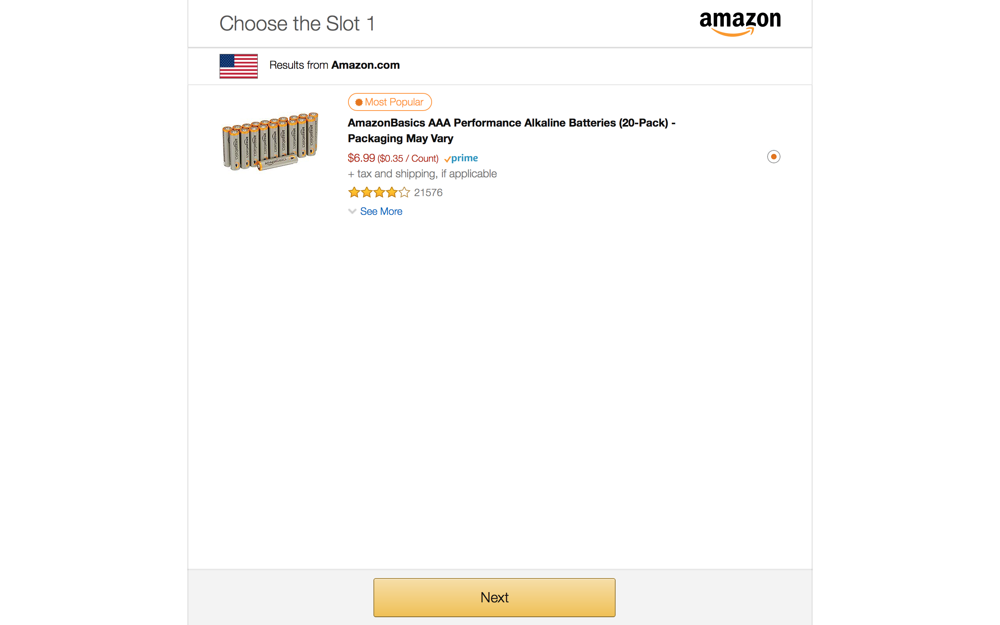

# AmazonDRS Examples #

This document describes the example applications provided with the [AmazonDRS library](../README.md).

## Replenish example ##

The example:
- Authenticates the device on Amazon platform using the library's [login()](../README.md#logindevicemodel-deviceserial-onauthenticated-testdevice) method which provides the authentication flow described [here](../README.md#authentication)
- Executes the following cycle: places a test order, waits for 8 sec, cancels the order, waits for 12 sec
- Logs all responses received from the Amazon DRS

**Please note that this example is not production-oriented at least due to the necessity of exposing agent's URL.**

Source code: [Replenish.agent.nut](./Replenish.agent.nut)

## Example Setup and Run ##

### Login To Amazon ###

Login to [Amazon Developer Services](https://developer.amazon.com/login.html).
If you are not registered as a developer, create a developer's account.

### Set Up Imp Device ###

1. [Set up a device](https://developer.electricimp.com/gettingstarted)
1. In the [Electric Imp's IDE](https://ide.electricimp.com) create new Product and Development Device Group.
1. Assign the device to the newly created Device Group.
1. Copy the [Replenish example source code](./Replenish.agent.nut) and paste it into the IDE as the agent code.
1. Make a note of the agent's URL. It will be required for the next steps.

1. Leave impCentral open in your browser &mdash; you will be returning to it later.

### Create an LWA Security Profile ###

This stage is used to authenticate the imp application in Amazon.

1. Launch your [Amazon Developer Console](https://developer.amazon.com/home.html).
1. Click on the **APPS & SERVICES** tab, then click **Login with Amazon**.

1. Click **Create a New Security Profile**.

1. Enter the following information:
    1. **Security Profile Name**: `example_sp`
    1. **Security Profile Description**: `example_sp_desc`
    1. **Consent Privacy Notice URL**: `https://example.com`
1. Click **Save**.

1. Then you'll be taken to your list of security profiles. Click the gear next to the Security Profile you created and select **Security Profile**.

1. Make a note of your **Client ID** and **Client Secret**.

1. Then click on the **Web Settings** tab and enter the agent's URL into the **Allowed Return URLs** field.

1. Click **Save**.
1. Do not close this page.

**Note:** any LWA Security Profile works only for the one agent the URL of which you entered in the **Allowed Return URLs** field.

### Create a device ###

1. In the [Amazon Developer Console](https://developer.amazon.com/home.html), click the **APPS & SERVICES** tab and choose **Dash Replenishment Service**.

1. If you open **Dash Replenishment Service** for the first time, Amazon may take you to **Dash Replenishment Account Setup**:

    1. Click **Begin**
    1. Choose your `example_sp` **Security Profile**

    1. Click **Next** several times and then click **Done**
1. Click the **CREATE A DEVICE** button.

1. In the appeared window, fill in the fields:
    1. **Name**: `example_device`
    2. **Model ID**: `example_model`

1. Click **Save**.
1. Then you'll be taken to your new device's page.
1. Open the **Slot Localization** tab and make a note of **Slot ID**.

### Adding API Keys to Your Agent Code ###

1. Return to impCentral.
1. Find the *AMAZON DRS CONSTANTS* section at the **end** of the agent code, and enter the **Client ID**, **Client Secret** and **Slot ID** from the steps above as the values of the *AMAZON_DRS_CLIENT_ID*, *AMAZON_DRS_CLIENT_SECRET* and *AMAZON_DRS_SLOT_ID* constants, respectively.

1. Again, do not close impCentral.

### Build and Run the Electric Imp Application ###

1. Click **Build and Force Restart** to syntax-check, compile and deploy the code.
1. On the log pane, you should see **Log in please** message. This example uses OAuth 2.0 for authentication, and the agent has been set up as a web server to handle the authentication procedure.
    1. Click the agent URL in impCentral.

    1. You will be redirected to the login page.
    1. Log into Amazon *on that page* and go through the suggested setup steps. Amazon may ask you to enter your address, credit card information, etc. Press the **Complete Setup** button to finish the setup process.
    
    1. After that the page should display **Authentication complete - you may now close this window**.
    1. Close that page and return to impCentral.
1. Make sure there are no errors in the logs.
1. Make sure there are periodic logs like this:

**Note**: The message "Your Refresh Token is Atzr|IwEB..." contains your **Refresh Token**. You may use it exploring the library or for testing purposes.
1. Your application is now up and running.
